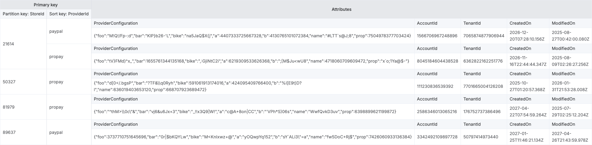

# Payment Configuration — data model docs

Visual references for the `PaymentConfiguration` DynamoDB table that the Configuration Recorder writes
to. These are design/visualization artifacts — the source of truth is the code (see
[How this maps to code](#how-this-maps-to-code)).

## Files

| File | What it is |
| --- | --- |
| [`ProviderConfiguration.json`](ProviderConfiguration.json) | An **AWS NoSQL Workbench** data-model export (format v3.0): the table's key schema, attributes, sample rows, and access patterns. Import it into NoSQL Workbench (*Import data model*) to explore or edit the design interactively. |
| [`PaymentConfigurations.png`](PaymentConfigurations.png) | A rendered snapshot of the Workbench **aggregate view** — the table with the sample rows from the model above. Handy for a quick look without opening Workbench. |



> The sample values (`foo`/`bar`/`bike`, random numbers) are Workbench-generated placeholders — they
> only illustrate shape and types, not real data.

## Table at a glance

One item per **store + provider**. The partition key is the store; the sort key is the provider, so a
store's providers live together in a single partition.

| Attribute | DynamoDB type | Role | Notes |
| --- | --- | --- | --- |
| `StoreId` | Number (`N`) | **Partition key** | The store the configuration belongs to. |
| `ProviderId` | String (`S`) | **Sort key** | e.g. `propay`, `paypal`. |
| `AccountId` | String (`S`) | attribute | Provider account id; the stable identity across credential rotations. Written only when present (sparse). |
| `TenantId` | Number (`N`) | attribute | The tenant the store belongs to. |
| `ProviderConfiguration` | String (`S`) | attribute | The provider payload, stored verbatim as JSON. |
| `CreatedOn` | String (`S`) | attribute | ISO 8601; first time the record was written. |
| `ModifiedOn` | String (`S`) | attribute | ISO 8601; last write. |

### Item collection — one partition per store

```
StoreId = 21614               ← partition
 ├─ ProviderId = "paypal"     → AccountId, TenantId, ProviderConfiguration, CreatedOn, ModifiedOn
 └─ ProviderId = "propay"     → …
StoreId = 50327
 └─ ProviderId = "propay"     → …
StoreId = 89637
 └─ ProviderId = "paypal"     → …
```

Because providers are sorted under the store partition, "get everything for a store" is a single
partition query (no scan).

## Access patterns

Captured in the model (`AccessPatterns`):

| Name | Operation | Key condition | Returns |
| --- | --- | --- | --- |
| `UpsertConfiguration` | `PutItem` | `StoreId` (PK) + `ProviderId` (SK) | inserts/overwrites one config |
| `GetStoreProviderConfiguration` | `GetItem` | `StoreId` (PK) + `ProviderId` (SK) | one config |
| `GetAllStoreConfigurations` | `Query` | `StoreId` (PK) only | every provider config for a store |

## How this maps to code

| Concern | Source |
| --- | --- |
| Model (CLR shape) | [`../../../Wayroo.Payments.Models/Wayroo.Payments.Models/PaymentProviderConfiguration.cs`](../../../Wayroo.Payments.Models/Wayroo.Payments.Models/PaymentProviderConfiguration.cs) |
| Attribute names + (de)serialization | [`../PaymentConfigurationSchemaProvider.cs`](../PaymentConfigurationSchemaProvider.cs) |
| Access patterns (queries/puts) | [`../PaymentConfigurationRepository.cs`](../PaymentConfigurationRepository.cs) |
| Provisioned table (PK/SK, GSI, KMS) | [`../../../Wayroo.Payments.Infrastructure/Wayroo.Payments.Infrastructure/Resources/PaymentConfigurationTable.cs`](../../../Wayroo.Payments.Infrastructure/Wayroo.Payments.Infrastructure/Resources/PaymentConfigurationTable.cs) |

## Keeping the model in sync

The Workbench model is a design draft. One thing to reconcile:

- **Table name differs.** The model is named `PaymentConfigurations` (plural); the deployed table is
  `{environment}-PaymentConfiguration` (singular, env-prefixed). The deployed name is authoritative.

Real tables are also encrypted with a customer-managed KMS key and have point-in-time recovery enabled
(see the CDK table) — those operational settings aren't represented in the Workbench model.
