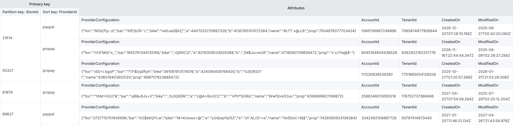

# Payment Configuration — data model docs

Visual references for the `PaymentConfiguration` DynamoDB table that the Configuration Recorder writes
to. These are design/visualization artifacts — the source of truth is the code (see
[How this maps to code](#how-this-maps-to-code)).

## Files

| File | What it is |
| --- | --- |
| [`ProviderConfiguration.json`](ProviderConfiguration.json) | An **AWS NoSQL Workbench** data-model export (format v3.0): the table's key schema, every attribute, and sample rows under two facets — *Provider configuration* and *Store routing*, the two item shapes that share a store's partition. Import it into NoSQL Workbench (*Import data model*) to explore or edit the design interactively. |
| [`PaymentConfigurations.png`](PaymentConfigurations.png) | A rendered snapshot of the Workbench **aggregate view**. Handy for a quick look without opening Workbench. |



> **The PNG is older than the JSON.** It was rendered before the account-information and routing
> attributes existed, so it shows neither them nor the `#routing` item, and it still carries the old
> Workbench-generated `foo`/`bar`/`bike` sample values. Regenerating it needs the Workbench GUI.
> Until then, trust the JSON and the tables below over the picture.

> Sample values in the JSON illustrate shape and types, not real data. The two payload attributes
> really do hold provider credentials and account PII, so their samples are deliberately labelled
> placeholders rather than realistic-looking values.

## Table at a glance

One item per **store + provider**. The partition key is the store; the sort key is the provider, so a
store's providers live together in a single partition.

| Attribute | DynamoDB type | Role | Notes |
| --- | --- | --- | --- |
| `StoreId` | Number (`N`) | **Partition key** | The store the configuration belongs to. |
| `ProviderId` | String (`S`) | **Sort key** | e.g. `propay`, `paypal`. |
| `AccountId` | String (`S`) | attribute | Provider account id; the stable identity across credential rotations. Written only when present (sparse). |
| `TenantId` | Number (`N`) | attribute | The tenant the store belongs to. |
| `ProviderConfiguration` | String (`S`) | attribute | The provider's **credential** payload (Tap to Pay / merchantware), stored verbatim as JSON. Written by the recorder. |
| `ProviderAccountDetails` | String (`S`) | attribute | The provider's **account information**, stored verbatim as JSON. Written by the account refresh. |
| `AccountStatus` | String (`S`) | attribute | The provider-neutral standing derived from the account information, by enum *name*. |
| `AccountDetailsRefreshedOn` | String (`S`) | attribute | ISO 8601; when the account information was last read from the provider. |
| `AcquiringProviderId` | String (`S`) | attribute | **Routing item only.** The provider the store's new payments go to. |
| `MigrationState` | String (`S`) | attribute | **Routing item only.** Where the store sits in the provider migration. |
| `ConfigurationVersion` | Number (`N`) | attribute | **Routing item only.** Incremented server-side on every routing write; travels as the integration event's `Sequence`. |
| `CreatedOn` | String (`S`) | attribute | ISO 8601; first time the record was written. |
| `ModifiedOn` | String (`S`) | attribute | ISO 8601; last write. |

### Three writers, one record

The record has three independent writers, and they arrive in no fixed order:

| Writer | Item | Owns |
| --- | --- | --- |
| `Wayroo.Payments.ConfigurationRecorder.Lambda` (provider webhook) | `{provider}` | `ProviderConfiguration` |
| `PaymentAccountManager.RefreshAccount` (account refresh / backfill) | `{provider}` | `ProviderAccountDetails`, `AccountStatus`, `AccountDetailsRefreshedOn` |
| A provider cutover (`UpsertRouting`) | `#routing` | `AcquiringProviderId`, `MigrationState`, `ConfigurationVersion` |

The two provider-row writers share an item, so **neither uses `PutItem`** — a whole-item put by
either would silently erase the other's attributes, taking Tap to Pay credentials or a store's
recorded standing with it. Each issues an `UpdateItem` naming only what it owns
(`PaymentConfigurationSchemaProvider.GetConfigurationUpdate` / `GetAccountDetailsUpdate`), and
`CreatedOn` is seeded with `if_not_exists` so the earlier writer keeps it. Routing sits on its own
item, so a cutover cannot disturb either — but it shares the partition, which is the sharp edge:
**anything listing a store's providers has to skip the `#routing` sort key**, or it hands back a
provider configuration that is not one.

`ConfigurationVersion` is incremented with `ADD`, never written from a value read earlier. Two
concurrent writers must not land on the same version, because consumers discard an update carrying a
version they have already applied — a duplicated one would make a real change read as stale.

Held in place by the integration tests `UpsertConfiguration_DoesNotEraseRecordedAccountDetails`,
`UpsertAccountDetails_DoesNotEraseTheCredentialPayload`,
`UpsertRouting_DisturbsNeitherTheCredentialsNorTheAccountDetails`,
`UpsertRouting_IncrementsTheVersionOnEveryWrite` and
`GetConfigurationsForStore_DoesNotReturnTheRoutingRecord`.

### Which provider is a store on?

`AcquiringProviderId` on the `#routing` item is the platform's source of truth, and Orders keeps a
read model of it (see `StoreProviderConfigChanged`). `PaymentAccountManager` resolves it in one read:
the recorded value if there is one, otherwise the configured default provider. A store with no routing
item therefore behaves exactly as it always did, which is what makes the mechanism inert and means
**no data backfill was required to turn it on**. A routing value naming a provider with no gateway
raises rather than quietly falling back.

### Item collection — one partition per store

```
StoreId = 21614               ← partition
 ├─ ProviderId = "#routing"   → AcquiringProviderId, MigrationState, ConfigurationVersion
 ├─ ProviderId = "paypal"     → AccountId, TenantId, ProviderConfiguration, CreatedOn, ModifiedOn
 └─ ProviderId = "propay"     → …
StoreId = 50327
 └─ ProviderId = "propay"     → …
StoreId = 89637
 └─ ProviderId = "paypal"     → …
```

Because providers are sorted under the store partition, "get everything for a store" is a single
partition query (no scan).

## Access patterns

Carried in the Workbench export's top-level `AccessPatterns` block, and implemented in
[`PaymentConfigurationRepository.cs`](../PaymentConfigurationRepository.cs), which is the source of
truth.

Two of the pattern names predate the code and differ from the method that ended up implementing them.
The export keeps the original design-time names, so the mapping is worth having in front of you:

| Access pattern (in the model) | Repository method | Operation | Key condition | Returns |
| --- | --- | --- | --- | --- |
| `UpsertConfiguration` | `UpsertConfiguration` | `UpdateItem` | `StoreId` (PK) + `ProviderId` (SK) | merges the credential attributes into one config |
| `UpsertAccountDetails` | `UpsertAccountDetails` | `UpdateItem` | `StoreId` (PK) + `ProviderId` (SK) | merges the account-information attributes into one config |
| `GetRouting` | `GetRouting` | `GetItem` | `StoreId` (PK) + `#routing` (SK) | the store's routing, or nothing |
| `UpsertRouting` | `UpsertRouting` | `UpdateItem` | `StoreId` (PK) + `#routing` (SK) | writes routing and increments its version |
| `GetStoreProviderConfiguration` | **`GetConfiguration`** | `GetItem` | `StoreId` (PK) + `ProviderId` (SK) | one config |
| `GetAllStoreConfigurations` | **`GetConfigurationsForStore`** | `Query` | `StoreId` (PK) only | every provider config for a store |

Every write is an `UpdateItem` and none is a `PutItem` — see [Three writers, one
record](#three-writers-one-record). Workbench only accepts `Scan`, `Query`, `GetItem`, `PutItem`,
`UpdateItem` and `DeleteItem` as a pattern's operation, so an `UpdateItem` that merges named
attributes is as precise as the model can be about it.

## How this maps to code

| Concern | Source |
| --- | --- |
| Model (CLR shape) | [`../../../Wayroo.Payments.Models/Wayroo.Payments.Models/PaymentProviderConfiguration.cs`](../../../Wayroo.Payments.Models/Wayroo.Payments.Models/PaymentProviderConfiguration.cs) |
| Attribute names + (de)serialization | [`../PaymentConfigurationSchemaProvider.cs`](../PaymentConfigurationSchemaProvider.cs) |
| Access patterns (queries/puts) | [`../PaymentConfigurationRepository.cs`](../PaymentConfigurationRepository.cs) |
| Provisioned table (PK/SK, GSI, KMS) | [`../../../Wayroo.Payments.Infrastructure/Wayroo.Payments.Infrastructure/Resources/PaymentConfigurationTable.cs`](../../../Wayroo.Payments.Infrastructure/Wayroo.Payments.Infrastructure/Resources/PaymentConfigurationTable.cs) |

## Keeping the model in sync

The export matches the schema the code writes as of 2026-08-31: same partition and sort key, every
attribute both item shapes use, all six access patterns, and sample rows covering the partial states a
record passes through (credentials but no recorded standing, a standing seeded by a backfill with no
credentials yet, and a store mid-migration). `AccountStatus` and `MigrationState` samples use real enum
names and constants.

Two mechanical traps if you hand-edit the JSON rather than round-tripping it through Workbench:

- **Sample rows belong in `TableFacets` only.** Workbench merges each facet's `TableData` into the
  table, so listing an item in both the facet and the table-level `TableData` makes its
  `(StoreId, ProviderId)` pair appear twice and the import fails with *"attribute value pair ... is
  not unique"*. Table-level `TableData` is deliberately `[]`.
- **`AccessPatterns` is top-level**, a sibling of `DataModel` — not a property of the table inside it.
  A table-level `AccessPatterns` key reads as absent.

What the model still does **not** represent, all of it operational and all of it in
[the CDK table](../../../Wayroo.Payments.Infrastructure/Wayroo.Payments.Infrastructure/Resources/PaymentConfigurationTable.cs):

- **The environment prefix.** The model is named `PaymentConfiguration`, matching
  `DynamoDbClientOptions.DefaultPaymentConfigurationTableName`; every deployed table is
  `{environment}-PaymentConfiguration`. Getting that prefix wrong is not theoretical — it reads as a
  `ResourceNotFoundException` on the first query, from a service that started up healthy.
- **Point-in-time recovery** (35 days) and the **DynamoDB stream** (`NEW_AND_OLD_IMAGES`).
- **Encryption.** Note that the deployed tables are *not* on a customer-managed key today: the CDK's
  `Encryption = TableEncryption.CUSTOMER_MANAGED` line is commented out with a `TEMP` note, because
  the deploying CloudFormation role lacks `kms:CreateKey`, so DynamoDB falls back to its default
  AWS-owned key. These records hold live payment credentials, so that is worth re-enabling.

A schema change belongs in three places: `PaymentConfigurationSchemaProvider` (the attribute names),
this README, and the export. The first is authoritative; the other two are documentation and will not
fail a build if you forget them.
